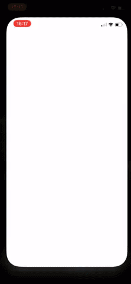

# It's Boba Time

made with ❤️ Ryan Paglinawan

## Description:
This application is just a hypothetical app for ordering and customizing your boba tea drinks. Inspired by other apps like Philz Coffee, and sitting in a boba shop wondering if it would be possible to make something that would allow you to order boba and customize it.
    
This mockup of a user interface was made with `` `5104 bytes` `` right under the ```5120 bytes``` maximum.

## Instuctions:
Use the ```.yaml``` provided nothing other that that is required.
Designed for everyone and every device (I would recommend an OLED smartphone or for those that have it the Nexbit Robin)


## Disclaimers:
Usage for educational purposes and non-profits: ✅
Usage for commercial purposes: Ask first please cause I got bills to pay. [E-Mail]

Other legal stuff here 

License
----

MIT

## Contact Me:
[Instagram]
[YouTube]
[E-Mail]

[Instagram]:<https://www.instagram.com/pags_r1a/>
[YouTube]:<https://www.youtube.com/channel/UCXq50CnRKetkAXjVIAvWyiw>
[E-Mail]:<mailto:rymotion1@me.com>
